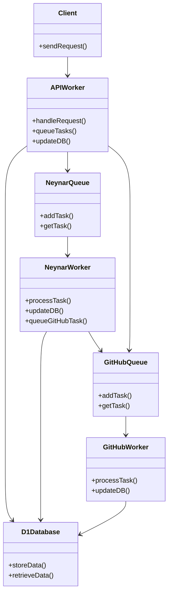

# GitCast Server

This repo powers [GitCast](https://gitcast.dev), a Farcaster Mini App that merges GitHub feeds and data with the Farcaster social graph. In order to do this efficiently the backend will index Farcaster users with GitHub verifications through Warpcast, store that info in a database, then run queus to process events and repo data.

## Architecture

The system consists of several microservices deployed as Cloudflare Workers:

## Services

1. **API Worker** (`api-worker/`): Handles client requests and serves data from the database
2. **Neynar Worker** (`neynar-worker/`): Processes Farcaster-related tasks from the queue
3. **GitHub Worker** (`github-worker/`): Processes GitHub-related tasks from the queue

## Data Flow

1. User bootstraps their feed by calling the init endpoint (optional)
2. API worker queues Neynar tasks to fetch user's following list
3. Neynar worker processes tasks and queues GitHub verification checks with Warpcast API
4. When GitHub usernames are identified, tasks are queued to fetch GitHub events
5. GitHub worker processes events and stores them in the database
6. API worker serves the aggregated feed to the client
7. Separately has endpoints to index starred repositories by Farcaster users

## Shared Code

The `shared/` package contains common utilities and types used across all workers:
- GitHub API client
- Warpcast/Neynar API client
- Type definitions
- Utility functions

## Database Schema

The system uses Cloudflare D1 with the following tables:
- `users`: Stores Farcaster and GitHub user information
- `follows`: Tracks follower relationships between users
- `github_events`: Stores GitHub activity events
- `repositories`: Stores repository metadata
- `user_stars`: Maps users to repositories they've starred

## Questions

Feel free to [reach out](mailto:hello@stevedylan.dev)!
